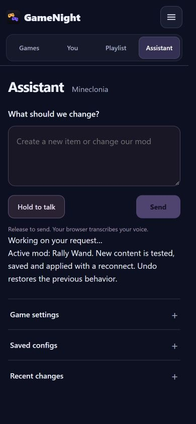
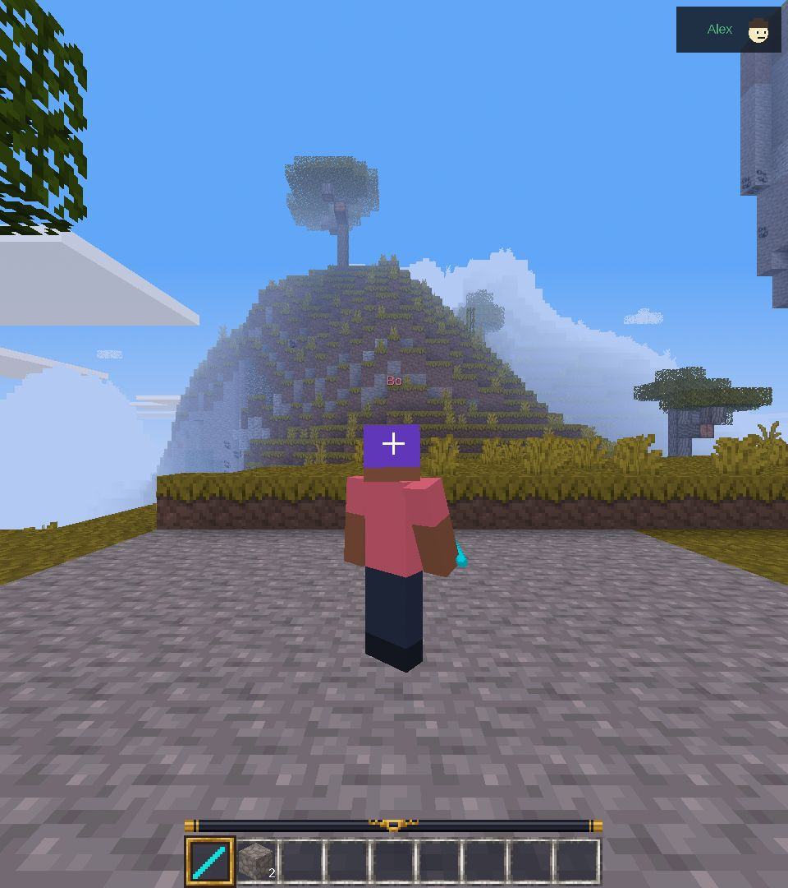

# Generated mod playtest — 4 October 2026

**Partial acceptance. Original item creation works; model-generated follow-up editing did not pass.**

The local model created an original Rally Wand in Lua. The real cloud, public
relay, Windows adapter, Mineclonia server and two clients installed it and
reconnected. Scripted controller RT input launched the other player vertically,
left the wielder in place and recorded a persistent counter. Both profile skins
remained available. Deliberately invalid Lua was rejected without changing the
live source, revision or client PIDs.

Follow-up requests asked for an orange wand with a horizontal launch component.
Qwen3.6 35B first exhausted 4096 output tokens, then timed out with an 8192-token
reasoning allowance. A non-reasoning request was stopped after 535 seconds.
Gemma4 returned an edit in 30 seconds but closed a Lua callback with `end}`.
It repeated that syntax error in compiler-feedback repair attempts, including
with reasoning enabled. The validator rejected every candidate and retained the
working original. No developer-corrected source was substituted for model output.

Consequently, follow-up gameplay, counter persistence across a successful edit,
and real-engine source undo remain unverified by this run. Unit tests cover
staging, callback behavior, persistent storage and rollback paths; they do not
replace those missing acceptance checks. The original model program also stores
a cooldown timestamp based on an elapsed clock that resets at restart, which can
delay later use. This is another semantic issue for model evaluation, beyond
compilation and execution limits.

The [report](report.json) contains all requests, outcomes, timings and available
proposal source. No private account tokens or model reasoning are included.
The test uses scripted host/controller frames and a disposable arrangement probe;
it does not establish physical controller comfort or microphone capture.
One infrastructure retry loaded an older shared cloud executable; the final
runs used a copied executable from the isolated branch.

## Scope and checks

- Development overlay on the v0.1.3 Windows package, not a newly published ZIP.
- 60 Python tests and LuaJIT execution checks passed; Ruff lint/format passed.
- Public adapter CI, public docs CI and private cloud CI passed.
- The SDK boundary remains experimental and needs more hostile-code testing,
  including sustained heap growth, before accepting untrusted shared libraries.
- Store v0.1.3 and approved catalog previews remain unchanged.

